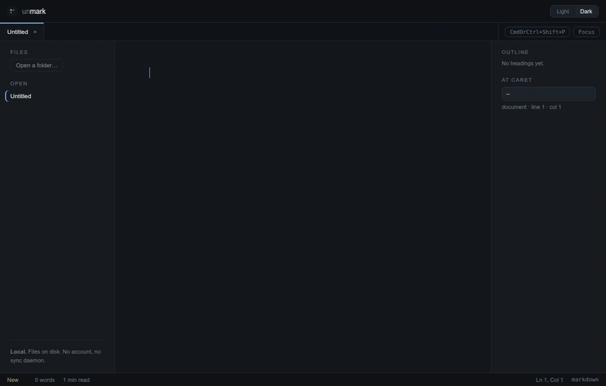

<div align="center">


# unmark

**A markdown editor with no modes.**

Typing the final `*` of `**test**` makes the word bold and the asterisks
disappear. Move the caret back in and they come home. There is no source view,
no preview pane, and no button that switches between them.

The two ends of a construct are not quite symmetric, and on purpose. The caret
one step *past* the end leaves it rendered — that is what makes the closing `*`
take effect on the keystroke. The caret on its *first* position keeps it open,
because that is where you type the character that changes what it is: a `!` in
front of `[link](photo.jpg)` turns the link into an image, and you cannot aim
at a marker that has collapsed.



</div>

---

## What this is

Two things, from one repository:

| | |
|---|---|
| **`@md/core`** | A framework-agnostic CodeMirror 6 library. Drop it into any web app. |
| **unmark** | An Electron desktop editor built on it. |

**The document is the markdown string.** Not a rich-text model that serialises
to markdown — the actual text, byte for byte as it sits on disk. Rendering is
decorations layered over it. Open a file, save it untouched, and the bytes are
identical: no line-ending normalisation, no BOM stripping, no trailing-newline
fixups. There is a test for exactly that, and it runs on every commit.

### Links and images

A link renders as its label; `](https://…)` folds away with everything else.
**Mod-click** opens it, and holding Mod underlines links so you can see what is
clickable before you commit to it. Move the caret in and the URL comes back for
editing, like any other syntax.

Images can render in place, but only when the app gives `@md/core` a way to
resolve their `src` — the library cannot know where your document lives. The
desktop app serves local files through a read-only `unmark-asset:` scheme, and
**does not fetch remote images**: a tracking pixel in a document you merely
opened would report your IP to whoever wrote it, and this app has no telemetry
of its own to make that a fair trade.

An image reads as its alt text by default, styled like the link it is — the
same thing the editor does with every other construct. **Toggle Image Preview**
draws the picture in its place instead — `Ctrl/Cmd+Shift+M`, or the View menu,
or the command palette, all three from the one registry entry.

The caret outranks the mode in both directions. Wherever it sits inside an
image, you get the whole `` back to edit, exactly as with every
other marker — preview mode does not make an image uneditable. And whenever
that markdown is revealed, a preview of the picture floats above the line, so
the one moment the image would otherwise be off screen is the one moment you
are typing its path. No shortcut for that part: if the syntax is showing, so
is the image.

A source that will not load — a typo in the path, or one the shell declines to
resolve — draws a broken-image placeholder carrying the alt text, in place and
in the floating preview alike. It never becomes the browser's own broken-image
glyph, which would not say which image failed.

Preview mode is per editor and lives in editor state, so it is not remembered
between sessions. It does not override the remote-image policy above: an
`https://` image has no resolvable source, so it shows the placeholder rather
than being fetched.

### Code blocks

A fenced block shows its highlighted code and nothing else — the ``` lines go
with the rest of the syntax. Put the caret anywhere in the block and both
fences come back, language tag included, so the language stays editable. A
block with no body keeps its fences: there would be nothing left of it
otherwise.

Front matter and setext underlines are the constructs that stay visible. A
`---` fence that vanished would take a document's metadata off the page with
it, and a setext heading with no underline is indistinguishable from a
paragraph.

Editable inline tables are not implemented. They are their own project, not a
corner of this one.

### Not on the list

No vault, graph view, backlinks or wiki-links. No plugin ecosystem. No cloud
sync, no accounts, no telemetry. No mobile, no collaborative editing.

---

## Using `@md/core`

```bash
npm install @md/core
```

Every `@codemirror/*` and `@lezer/*` package is a **peer dependency**. Two
copies of `@codemirror/state` in one bundle breaks CodeMirror at runtime, so
the library refuses to bring its own.

```ts
import { createEditor } from '@md/core'
import '@md/core/style.css'

const view = createEditor({
  parent: document.querySelector('#editor')!,
  doc: '# Hello\n\nType **bold** and watch the asterisks fold away.',
  onChange: (markdown) => save(markdown)
})
```

`createEditor` returns a plain `EditorView`. You own it: change the document
with `view.dispatch()`, read it with `serializeDocument(view.state)` — which,
unlike `doc.toString()`, gives you back the line endings the file arrived with.

### React

```bash
npm install @md/react
```

```tsx
import { MarkdownEditor, type MarkdownEditorHandle } from '@md/react'

function Editor() {
  const editor = useRef<MarkdownEditorHandle>(null)
  return <MarkdownEditor ref={editor} defaultValue={initial} onChange={save} />
}
```

There is no `value` prop, deliberately. The component is uncontrolled: the view
is created once and destroyed on unmount, and no parent re-render can rebuild
it. A controlled editor rebuilds on every keystroke and takes the caret, the
undo history and any in-flight IME composition with it.

---

## Theming

**The whole editor restyles from one block of custom properties. You never
write a `.cm-*` selector.** That is the contract, and it is what makes the
library usable outside this app.

```css
/* A third-party app theming the editor. This is the entire integration. */
.my-app {
  /* Typography */
  --md-font-body: 'Literata', Georgia, serif;
  --md-font-mono: 'Berkeley Mono', monospace;
  --md-font-size: 18px;
  --md-line-height: 1.7;

  /* Surfaces and ink */
  --md-color-bg: #fffdf7;
  --md-color-text: #2b2723;
  --md-color-muted: #8a8177;
  --md-color-border: #e8e0d4;
  --md-color-accent: #b45309;
  --md-color-selection: #fde9c8;

  /* The characters that fold away */
  --md-color-marker: #ccc2b4;

  /* Blocks */
  --md-color-heading: #1a1613;
  --md-color-code-bg: #f6f1e7;
  --md-color-quote-border: #e8e0d4;

  /* Scale and measure */
  --md-h1-size: 1.9em;
  --md-h2-size: 1.4em;
  --md-h3-size: 1.15em;
  --md-content-width: 680px;
  --md-content-padding: 48px 32px 40vh;
}
```

Redefine them again under a `[data-theme='dark']` wrapper and you have a dark
theme. `@md/core` ships light defaults on `:root` plus a dark palette under
`prefers-color-scheme`, so it looks right before you touch anything.

The full list — including `--md-heading-weight`, `--md-heading-line-height`,
`--md-mono-size`, `--md-color-code`, `--md-color-link`, `--md-color-cursor`,
`--md-color-rule` and the `--md-hl-*` tokens for fenced-code highlighting —
lives in [`packages/core/src/theme/core.css`](packages/core/src/theme/core.css),
which is the contract itself.

---

## Installing the app

There are no published releases yet — build the installer for your platform,
then install it the normal way. Building needs Node 20+ and pnpm 11.

```bash
git clone <this repo> && cd unmark
pnpm install
pnpm --filter unmark-desktop dist          # installers for the current platform
```

Everything lands in `apps/desktop/release/`.

### Linux

`dist` produces an AppImage, a `.deb` and a tarball.

```bash
# AppImage — no install, just run it
chmod +x apps/desktop/release/unmark-2.0.1.AppImage
./apps/desktop/release/unmark-2.0.1.AppImage

# .deb — Debian, Ubuntu, Mint
sudo apt install ./apps/desktop/release/unmark-desktop_2.0.1_amd64.deb
unmark                                     # now on your PATH
unmark notes.md                            # or open a file directly

# tarball — unpack anywhere
tar xzf apps/desktop/release/unmark-desktop-2.0.1.tar.gz
./unmark-desktop-2.0.1/unmark
```

The `.deb` puts unmark in your application menu, registers it as a handler for
`.md` files, and symlinks `/usr/bin/unmark`. Uninstall with
`sudo apt remove unmark-desktop`.

### macOS

`dist` produces a `.dmg` and a `.zip` for both Apple Silicon and Intel. Open the
dmg and drag unmark to Applications.

The build is unsigned, so Gatekeeper will refuse the first launch. Right-click
the app and choose **Open**, or clear the quarantine flag:

```bash
xattr -dr com.apple.quarantine /Applications/unmark.app
```

Signing and notarising needs an Apple Developer certificate — set
`CSC_LINK`/`CSC_KEY_PASSWORD` and electron-builder handles the rest.

### Windows

`dist` produces an NSIS installer and a portable `.exe`. The installer lets you
pick the location and installs per-user, so it needs no administrator rights.

The build is unsigned, so SmartScreen will warn on first run — **More info →
Run anyway**.

### Opening files

Once installed, `.md` and `.markdown` files open in unmark from the file
manager, and the command line takes paths:

```bash
unmark                      # empty document
unmark notes.md             # opens the file
unmark a.md b.md c.md       # one tab each
```

Running it again while a window is open adds tabs to that window rather than
starting a second copy — two editors with separate ideas of which files are
dirty is a good way to lose work.

### Cross-building

You can only build installers for the platform you are on. macOS dmg needs
macOS; Windows NSIS needs Windows (or Wine). CI with a matrix of runners is the
usual answer.

### Running it without installing

To try the app without producing an installer at all:

```bash
pnpm install
pnpm dev
```

That is the development setup below, and it runs the same code.

---

## Development

**Requirements:** Node 20 or newer, and pnpm 11 (`corepack enable` will pick
up the right version from `packageManager` in `package.json`).

```bash
pnpm install
pnpm sandbox:fix   # Linux only, once — see "sandbox errors" below
pnpm dev
```

`pnpm dev` builds `@md/core` and `@md/react`, then starts electron-vite: the
renderer gets a Vite dev server with hot reload, and the Electron window opens
against it. Editing anything under `apps/desktop/src/renderer` updates the
window immediately. Editing `src/main` or `src/preload` restarts Electron.

**If you are also changing the library**, run this in a second terminal:

```bash
pnpm dev:libs     # rebuilds packages/* on every change
```

The app resolves `@md/core` to its **built** output, so a change under
`packages/` is invisible to a running dev server without it. This is the single
most common way to lose ten minutes here: you edit a decoration rule, nothing
happens in the window, and the code looks right — because the app is still
running the last build.

### If Electron will not start: sandbox errors

Two different messages, one underlying problem:

```
FATAL: The SUID sandbox helper binary was found, but is not configured correctly.
FATAL: No usable sandbox!
```

Chromium sandboxes a renderer on Linux one of two ways: unprivileged user
namespaces, or a small setuid helper binary. On a stock Ubuntu 23.10 or later,
**neither is available out of the box** — AppArmor blocks unprivileged user
namespaces, and npm and pnpm unpack `chrome-sandbox` as an ordinary file owned
by you rather than root-owned with mode 4755. Rather than run a renderer with
no sandbox at all, Chromium stops.

Fix it once:

```bash
pnpm sandbox:fix
```

That sets root ownership and mode 4755 on the helper — one sudo prompt, one
file inside `node_modules`. It works whatever AppArmor thinks of namespaces,
which is why it is the remedy here rather than a system-wide sysctl or a new
AppArmor profile. **Re-run it after any `pnpm install` that re-extracts
Electron**, since the file gets replaced.

Where user namespaces *are* permitted, `pnpm dev` gets there on its own by
passing `--disable-setuid-sandbox`, and you never see any of this.

**Do not reach for `--no-sandbox`.** Chromium's own error message suggests it,
and it is the top answer everywhere, and it disables the renderer sandbox
outright — in an app that opens files other people wrote, whose renderer runs
with `sandbox: true` for exactly that reason. The difference is real, measured
on this app's process tree:

| launch | `Seccomp` in `/proc/<pid>/status` | user namespace |
|---|---|---|
| default | `2` — seccomp-bpf filter active | its own |
| `--disable-setuid-sandbox` | `2` — identical | its own |
| `--no-sandbox` | `0` on every process | the host's |

Packaged builds are unaffected: the `.deb`'s install script sets the same
permissions, and the AppImage carries its own helper.

> One trap if you go looking: `unshare --user true` succeeding proves nothing.
> `unshare` ships with an AppArmor profile that permits it, so it reports
> "namespaces work" on precisely the systems where they do not work for
> ordinary binaries like Electron.

### If Electron starts as plain Node

```
TypeError: Cannot read properties of undefined (reading 'whenReady')
```

Your terminal is running inside another Electron process — VS Code's integrated
terminal, or a coding agent hosted in one — and `ELECTRON_RUN_AS_NODE=1` is
inherited. Electron then boots as a Node runtime with no `app` object.

`pnpm dev` clears both variables for the child process and says so, so this
should not reach you. If you are launching Electron some other way:

```bash
env -u ELECTRON_RUN_AS_NODE -u ELECTRON_NO_ATTACH_CONSOLE <your command>
```

### The rest of the scripts

```bash
pnpm test         # everything, once
pnpm test:watch
pnpm typecheck    # tsc -b across all three projects
pnpm lint         # also enforces the @md/core dependency boundary (I2)
pnpm build:all    # packages and the desktop bundle
pnpm clean
```

Run a single package's tests with `pnpm --filter @md/core test`.

### Layout

```
packages/core     @md/core — the editor library. @codemirror/* and @lezer/* only.
packages/react    @md/react — the React binding.
apps/desktop      the Electron app: main, preload bridge, renderer.
```

---

## Releasing

`@md/core` and `@md/react` ship through changesets; the desktop app through
electron-builder.

```bash
pnpm changeset          # describe the change, pick the bump
pnpm version-packages
pnpm release            # build and publish the packages

pnpm --filter unmark-desktop dist          # installers for this platform
pnpm --filter unmark-desktop dist:linux    # or :mac / :win
```

macOS gets a dmg and a zip (arm64 + x64), Windows an NSIS installer and a
portable exe, Linux an AppImage, a deb and a tarball. `.md` files associate
with unmark on install. There is no auto-update server — §1's non-goals rule
out anything that phones home.

See [CONTRIBUTING.md](CONTRIBUTING.md) for the six architectural invariants and
the nine failure modes worth checking before debugging anything.

## License

MIT — see [LICENSE](LICENSE).
